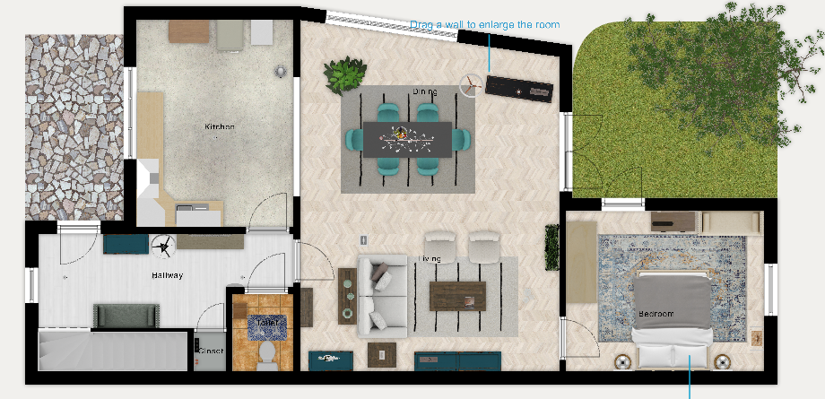
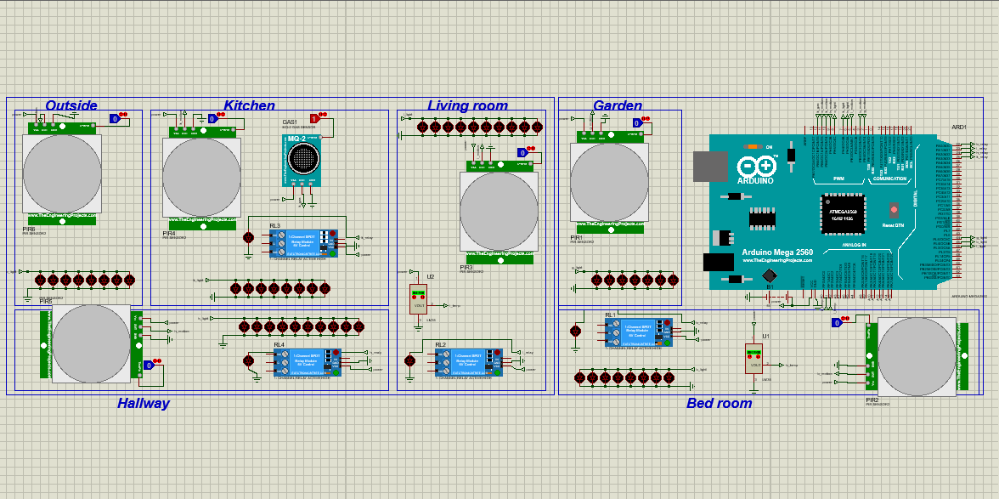
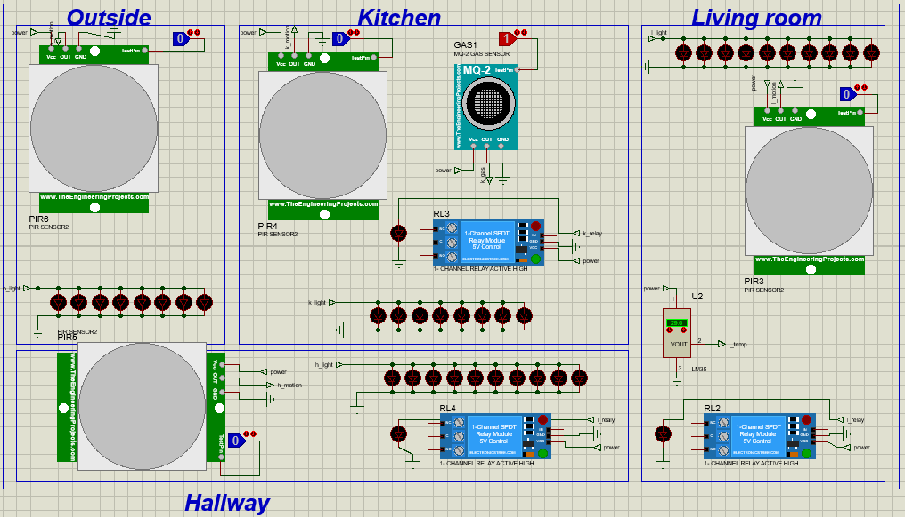
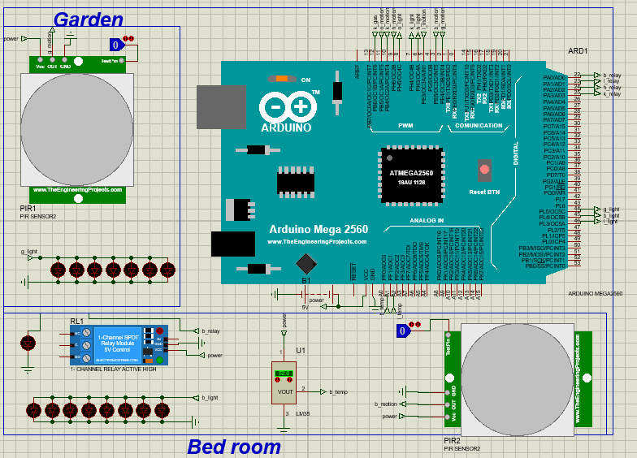
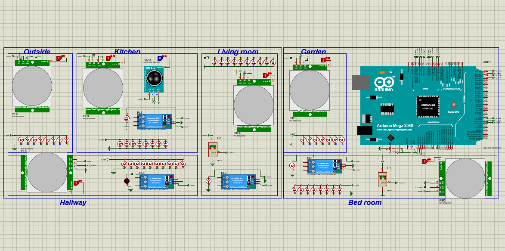
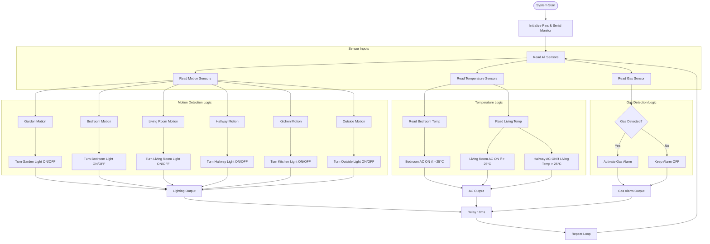

# 🏠 Smart Home Automation System Using Arduino

This project simulates a **Smart Home Automation System** using an Arduino Mega, PIR motion sensors, temperature sensors, a gas sensor, and relays in **Proteus**.

All lights, AC units, and alarms respond in real time to environmental conditions such as **motion**, **temperature**, and **gas leaks**.

---

## 📸 Simulation Previews

###  Arc Design:
<!-- Add screenshot of Proteus here -->
---

---

### 🔧 Proteus Design:
<!-- Add screenshot of Proteus here -->
---

---

---

---
### 💡 System Running:
<!-- Add photo of simulation running -->

---

## ⚙️ Features

- 🔹 Motion-based lighting control in 6 zones (garden, bedroom, living room, hallway, kitchen, outside)
- 🔹 Temperature-based air conditioner control in bedroom and living room
- 🔹 Hallway AC syncs with living room
- 🔹 Gas leak detection with alarm in kitchen
- 🔹 Real-time control using digital and analog input readings

---

## 🧠 How It Works (Simple Flow)

---

## 🧾 Components Used

| Component         | Quantity | Description                        |
|------------------|----------|------------------------------------|
| Arduino Mega      | 1        | Main microcontroller               |
| PIR Motion Sensor | 6        | For motion detection in 6 areas    |
| LM35              | 2        | Analog temperature sensor          |
| Gas Sensor (QM-2) | 1        | Active-LOW digital gas sensor      |
| Relay Modules     | 4        | Control ACs and gas alarm          |
| LEDs or Lamps     | 6        | Simulate lights (PWM or Digital)   |

---

## 🖥️ Pin Mapping Summary

| Room/Area  | Motion Pin | Temp Pin | Light Pin | Relay Pin | Notes                     |
|------------|------------|----------|-----------|-----------|---------------------------|
| Garden     | 2          | —        | 44        | —         | Motion → Light            |
| Bedroom    | 3          | A0       | 45        | 22        | Motion + Temp → Light/AC  |
| Living     | 5          | A1       | 46        | 23        | Motion + Temp → Light/AC  |
| Hallway    | 9          | —        | 6         | 24        | Sync AC with living room  |
| Kitchen    | 10         | —        | 7         | 25        | Motion + Gas → Light/Alarm|
| Outside    | 11         | —        | 8         | —         | Motion → Light            |

---

## 🧪 Simulation & Files

### 📂 What’s Included:
- `smart_home.ino` → Arduino code
- `auto_home.dsn` → Proteus design file
- `auto_home.pdsprj` → Proteus project file
- `/images/` → Simulation screenshots

---

## 🚀 How to Run

1. Open `auto_home.pdsprj` in **Proteus 8.12+**
2. Upload `smart_home.ino` to the Arduino Mega inside the simulation
3. Click **Run Simulation**
4. Try changing the inputs (motion, temperature, gas) to see lights, ACs, and alarms activate

---

## 🧠 Author

Mario Emad Boles – [LinkedIn](#)

This project is part of a larger **smart embedded systems series** focused on real-time home control logic.

---

## 📘 License

MIT License – Use freely, but please credit this repository if you reuse or modify.
